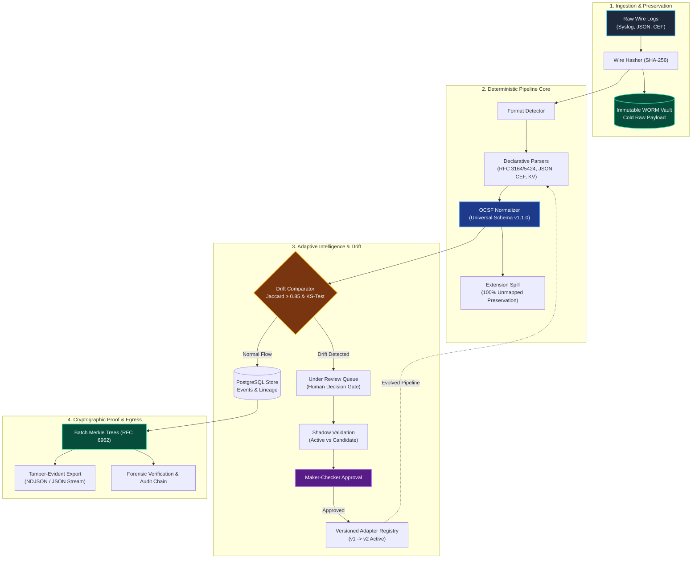

# LogForge AI

> **Universal Adaptive Log Pre-Processing Framework & Cryptographic Evidence Vault**  
> *Ingest any log, normalize to OCSF, detect structural drift, adapt with human governance, and guarantee zero evidence loss.*

---

## 🏛️ Simple System Architecture



---

## ⚡ 6-Step End-to-End Pipeline

| Step | Component | Action |
|:---:|:---|:---|
| **01** | **Wire Ingest** | Ingests raw text lines via `POST /api/v1/ingest` or batch endpoint `/ingest/batch` (up to 1,000 logs isolated). |
| **02** | **Raw SHA-256 Vault** | Computes SHA-256 hash immediately; locks raw bytes into local WORM storage before parsing. **Zero payload loss**. |
| **03** | **OCSF Normalization** | Selects vendor adapter (Cisco ASA, Fortinet, Palo Alto, or Onboarded) to map fields into standard OCSF v1.1.0 objects (`network`, `user`, `process`). Unmapped fields spill safely to `extensions`. |
| **04** | **Real-Time Drift Scoring** | Computes Jaccard structural similarity against learned baseline. If score $< 0.85$ or critical keys change, the log is flagged `UNDER_REVIEW`. |
| **05** | **Governed Adaptive Learning** | Onboard unknown vendors from 10–15 sample logs or accept drift changes. Candidate adapters run in an isolated shadow sandbox before a human engineer approves them. |
| **06** | **Merkle Sealing & Export** | Batches of validated events are sealed into RFC 6962 Merkle trees. Stream compliance-ready data out via `logforge.export.v1`. |

---

## 🛡️ Core Guarantees

1. **Zero Evidence Loss**: Raw logs are stored verbatim before parsing. Even when parsing fails, the original raw wire data and SHA-256 hash are preserved forever.
2. **Deterministic Runtime**: Parsing and normalization run 100% locally in-process without network calls, LLMs, or cloud dependencies.
3. **Poisoning-Resistant Governance**: All adapter evolutions require Maker-Checker separation of duties (proposer cannot be approver).
4. **Non-Destructive Historical Replay**: Backfill or re-parse historical log archives under newly approved adapters without altering original forensic records.

---

## 🚀 Quick Start (Docker)

```bash
# 1. Clone repository
git clone https://github.com/Kavish2808/logforge-ai.git
cd logforge-ai

# 2. Configure environment
cp .env.example .env

# 3. Build & start all services
docker compose up --build
```

### Access Points

* **Operational Console**: [http://localhost:5173](http://localhost:5173)
* **Backend API & Swagger Docs**: [http://localhost:8000/docs](http://localhost:8000/docs)
* **Health Check**: [http://localhost:8000/health](http://localhost:8000/health)

---

## 🧰 Technology Stack

* **Backend Core**: Python 3.11, FastAPI (Async), SQLAlchemy, Alembic, Pydantic v2
* **Storage & Integrity**: PostgreSQL 16, Content-Addressed WORM Storage, RFC 6962 Merkle Trees
* **Frontend Console**: React 18, TypeScript, Tailwind CSS, Lucide Icons, Vite
* **Standard**: Open Cybersecurity Schema Framework (OCSF v1.1.0)
* **Deployment**: Docker & Docker Compose (Fully air-gapped ready)

---

> ℹ️ *For the full 1,300-line comprehensive technical specification, consult [README_DETAILED.md](README_DETAILED.md).*
