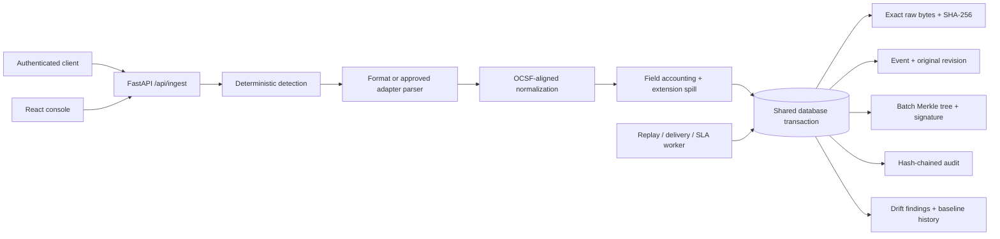
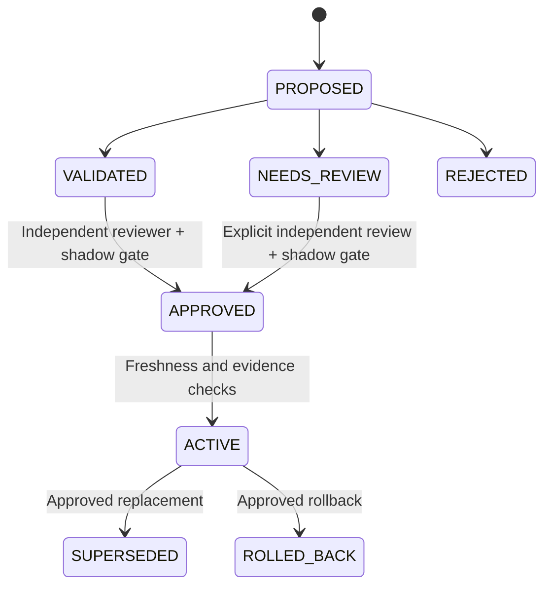
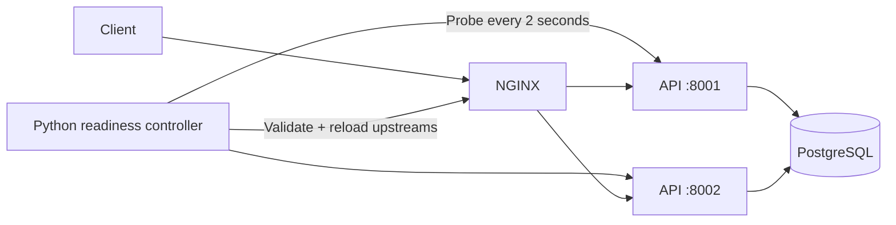

# Architecture

## Processing and persistence

`raw` is encoded as UTF-8 exactly as submitted after JSON decoding. For original non-UTF8 bytes, submit `raw_base64`. Transport JSON bytes are not treated as the log payload: the decoded event byte array is the preserved evidence. One event may be 1 byte through 1 MiB, batches contain 1–10,000 events, and the HTTP request body has a bounded size. Oversized or invalid request envelopes are rejected explicitly; they are not reported as accepted events.

Detection retains Syslog envelope priority, including Syslog-wrapped LEEF. The parser has no model dependency. Unknown or malformed payloads remain evidence, marked `PARTIAL` or `FAILED` where appropriate. Every flattened field is accounted for as a normalized field or a preserved extension, including normalization collisions.

## Consistency

The database is authoritative for accounts, sessions, raw vault entries, events, batches, revisions, adapters, source baselines, replay jobs, deliveries, alerts, and audit history. PostgreSQL is required for production mode. SQLite is supported for local development and tests.

Writes serialize through a shared PostgreSQL state-row lock (or SQLite's write transaction). This keeps audit-head updates, event deduplication, revisions, and Merkle batch commits consistent across API processes. It is intentionally a capacity boundary: adding API workers does not remove this database write bottleneck.

The API persists an ingestion batch atomically. A connection failure can occur after a successful commit but before the client receives its response. Clients must retry the identical request with the same `idempotency_key`. Reusing a key for a different request is a conflict. Event uniqueness also uses source plus `external_id`, when supplied, or source plus raw SHA-256. Identical raw events from one source are deduplicated by default. Supply distinct stable external IDs when identical payloads represent separate real events.

## Learning and governance

Candidate definitions are declarative. Supported parser options are validated, mappings have bounded targets, and executable code is never accepted. Automatic proposals are deterministic heuristics; an external LLM provider is not configured or required. A model-generated definition can be submitted through the same validation and approval boundary.

Shipped mappings are frozen configuration. Evolution is allowed only for active learned adapters with accepted drift evidence. Validation retests stored samples and historical events. Shadow testing compares the old and candidate pipelines over six strata with a target of 25 events per stratum. It reports missing coverage rather than manufacturing it. Raw hash mismatch, field/evidence loss, degraded parse status, execution errors, and latency regressions block activation.

Source baselines have history. Drift does not silently replace them. Golden pin/retire, baseline replacement, rollback, and large replay require recorded approval by a separate identity. Rollback selects an earlier approved adapter and preserves event history; reprocessing remains an explicit replay action.

## Replay and integrity

Replay uses an event sequence cursor and a high-water mark, a database checkpoint, bounded work units, and rate control. Each processed event creates a numbered `REPLAY` revision, while revision 1 remains `ORIGINAL`. A unique event/job constraint prevents a resumed replay from creating duplicate revisions. Raw evidence and batch Merkle information remain unchanged.

SHA-256 detects byte changes. Merkle roots and per-event proofs connect events to batches. A keyed batch signature adds tamper evidence for a party without the signing secret; the audit log is hash-chained. These mechanisms are not immutable storage. An operator with database and secret access can rewrite history. Stronger assurance requires independently controlled export anchors or an immutable storage service, which is not bundled here.

## Optional native routing

NGINX OSS does not provide this project's required active health checks by itself. The included native companion probes readiness, writes only validated IP/port upstream entries, validates the NGINX configuration, and reloads it atomically. Empty healthy pools fail closed. NGINX passive failure checks cover the interval between probes. No probe removes the failure-after-check race, so clients retain idempotency keys on retries.

Routing stays separate from processing. Each replica runs the same application code and reads the same database. Active-request capacity is bounded per process, saturation returns an explicit error, and drain/readiness endpoints allow a replica to leave the routing pool before shutdown. Adaptive load scoring remains a future option; current routing is round-robin.

