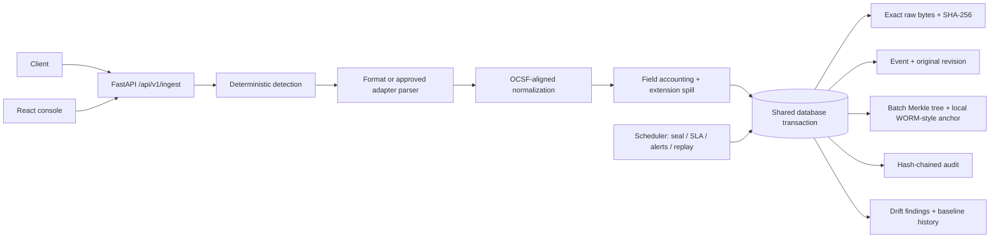
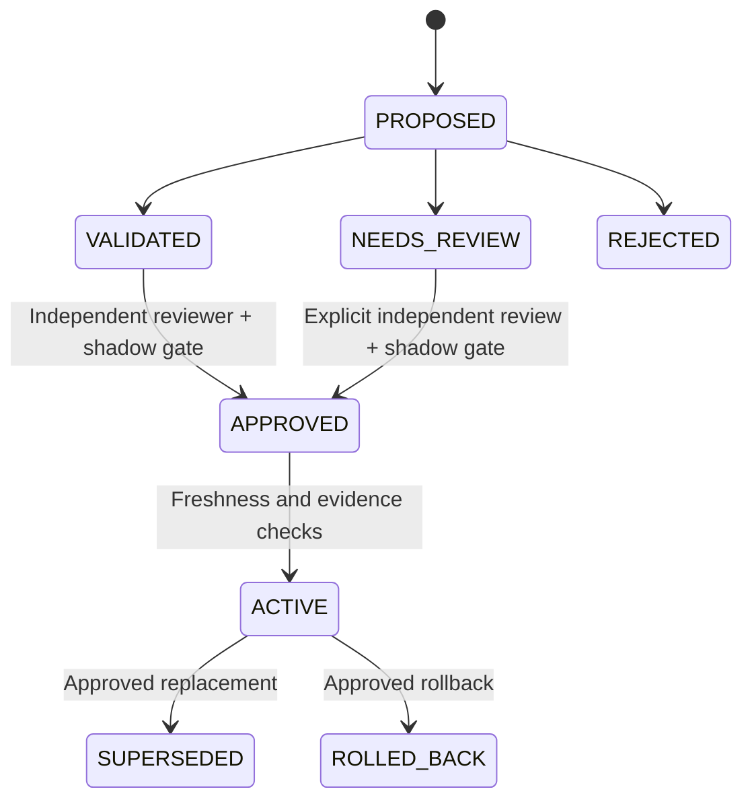
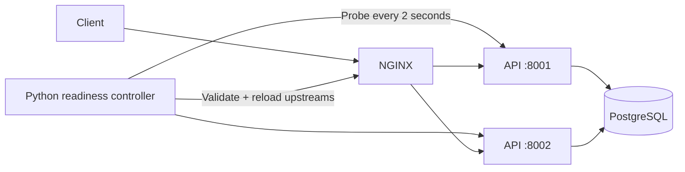

# Architecture

## Processing and persistence

`raw_log` is the UTF-8 text submitted in the JSON body (`POST /api/v1/ingest {"raw_log", "source_hint"?}`); its SHA-256 is computed over those UTF-8 bytes. Binary (non-UTF-8) payloads are not supported. One raw log may be 1 to 256,000 characters (NUL characters are rejected); `POST /api/v1/ingest/batch` accepts 1–1,000 logs, each ingested and committed independently. Invalid request envelopes are rejected with `422`; they are never reported as accepted events.

Detection retains Syslog envelope priority, including Syslog-wrapped LEEF: such an event is a syslog event, its LEEF attributes are not extracted into typed fields, and the complete LEEF payload is preserved in the normalized message (bare LEEF is parsed natively). The parser has no model dependency. Unknown or malformed payloads remain evidence, marked `PARTIAL` or `FAILED` where appropriate. Every flattened field is accounted for as a normalized field or a preserved extension, including normalization collisions.

## Consistency

PostgreSQL is the only supported database; it is authoritative for accounts, sessions, raw vault entries, events, batches, revisions, adapters, source baselines, replay jobs, alerts, and audit history. Webhook integration registrations are the exception: they are stored in a local JSON file on the API node (not replicated, not backed up).

Audit-log appends, Merkle sealing and admin bootstrap serialize through PostgreSQL advisory transaction locks, which keeps the audit hash chain and batch sequence consistent across API processes. This is a capacity boundary: adding API workers does not remove these serialization points.

Ingestion does not deduplicate: every accepted raw log becomes its own event with its own id, even when two payloads are byte-identical (they share the same `raw_hash`). There is no idempotency key; a client that retries after a lost response creates a second event.

## Learning and governance

Candidate definitions are declarative. Supported parser options are validated, mappings have bounded targets, and executable code is never accepted. Automatic proposals are deterministic heuristics; an external LLM provider is not configured or required. A model-generated definition can be submitted through the same validation and approval boundary.

Shipped mappings are frozen configuration. Evolution is allowed only for active learned adapters with accepted drift evidence. Validation retests stored samples and historical events. Shadow testing compares the old and candidate pipelines over six strata with a target of 25 events per stratum. It reports missing coverage rather than manufacturing it. Raw hash mismatch, field/evidence loss, degraded parse status, execution errors, and latency regressions block activation.

Source baselines have history. Drift does not silently replace them. Golden pin/re-pin/retire require an authenticated SOC_ADMIN with a written note (re-pin additionally refuses a SOC_ADMIN who approved the baseline changes being blessed); baseline replacement is a SOC_ADMIN critical approval; rollback requires a SECURITY_ENGINEER; a replay of more than 10,000 events must be started by a different authenticated engineer than its creator. Onboarding approval and learning approve/activate enforce maker-checker between authenticated users. Every decision record carries the acting identity: the signed-in user, or `anonymous` for unauthenticated calls in `RBAC_MODE=permissive` (the same identity the audit log records). Rollback selects an earlier approved adapter and preserves event history; reprocessing remains an explicit replay action.

## Replay and integrity

Replay uses an event sequence cursor and a high-water mark, a database checkpoint, bounded work units, and rate control. Each processed event creates a numbered `REPLAY` revision, while revision 1 remains `ORIGINAL`. A unique event/job constraint prevents a resumed replay from creating duplicate revisions. Raw evidence and batch Merkle information remain unchanged.

SHA-256 detects byte changes. Merkle roots and per-event inclusion proofs connect events to sealed batches; each batch root is chained to the previous one and written to a local append-only anchor file (not a compliance-grade WORM device); the audit log is hash-chained. `GET /api/v1/integrity/verify` recomputes every batch root, checks the chain and anchors, and re-hashes every stored raw event inside PostgreSQL: a raw event whose SHA-256 no longer equals its `raw_hash` (`RAW_HASH_MISMATCH`), or whose `raw_hash` differs from the value its Merkle leaf sealed (`EVENT_HASH_NOT_SEALED_LEAF`), makes the verification fail with the affected event and batch ids. Verification only detects; it never repairs a hash. These mechanisms are not immutable storage: an operator with database and filesystem access can rewrite history. Stronger assurance requires independently controlled anchors or an immutable storage service, which is not bundled here.

## Drift layers

| Layer | What it compares | Outcome |
|---|---|---|
| Structural (Phase 5, per event) | field set, order, count and parser-level JSON type against the source baseline and accepted variants | `DRIFT` + `UNDER_REVIEW` below the similarity threshold, or when a critical field is removed or changes parser type |
| Value shape (per event, `DRIFT_VALUE_SHAPE_ENABLED`) | the value of each critical field against the shape its typed target defines: `network.*_port` integer 0–65535, `network.*_ip` IPv4/IPv6 address, `timestamp` (only if declared critical) parseable by the adapter | `DRIFT` + `UNDER_REVIEW`, reason `CRITICAL_FIELD_VALUE_SHAPE_CHANGED`, change type `FIELD_VALUE_SHAPE_CHANGE`, expected/observed shape. Free-text fields (`event_action`, `severity`, …) have no shape, so ordinary value changes are never findings; empty values and vendor placeholders (`-`, `n/a`, …) count as "no value". The bootstrapping event's shapes are accepted with the auto-created baseline; accepting a drift (`add_variant`/`replace_baseline`) records its observed shape as accepted for that field |
| Statistical (Phase 8, on demand) | distributions of monitored fields between two windows (PSI, new/vanished categories, null rate, cardinality, median shift); ≥ 200 events per window | findings with evidence; never changes events or baselines |
| Semantic (Phase 8, advisory) | deterministic relabel heuristics on top of statistical findings | advisories only; never gates anything |

## Optional native routing

NGINX OSS does not provide active health checks by itself. The optional standalone script `deploy/health_router.py` probes each API's `GET /health`, writes only validated IP/port upstream entries, validates the NGINX configuration, and reloads it; it is not part of the Docker Compose stack. NGINX passive failure checks cover the interval between probes. No probe removes the failure-after-check race, and ingestion has no idempotency key, so a retried request after a lost response can create a duplicate event.

Routing stays separate from processing. Each replica runs the same application code and reads the same database. The API has no per-process admission limit and no drain endpoint; routing is round-robin. Webhook integration registrations are node-local (see Consistency).

