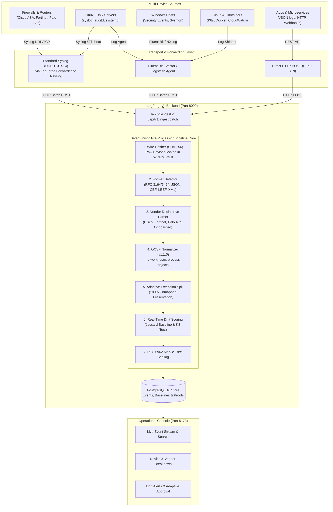

# LogForge AI — Multi-Device Ingestion & Pre-Processing Flow Guide

This document describes the complete flow for connecting multiple devices (firewalls, routers, servers, cloud instances, microservices, and endpoints) to LogForge AI so their logs are ingested and processed immediately through the deterministic pre-processing pipeline.

---

## 1. High-Level Flow Architecture



---

## 2. Ingestion Options by Device Type

### Method A: Network Appliances (Cisco, Fortinet, Palo Alto, Routers, Switches)
Network appliances typically cannot invoke HTTP endpoints directly; they output standard RFC 3164/5424 Syslog or CEF over UDP/TCP port 514.

Use the included lightweight forwarder:
```bash
python scripts/syslog_forwarder.py --host 0.0.0.0 --port 514 --proto udp --target http://localhost:8000/api/v1/ingest/batch
```
*(On Linux/macOS, use `sudo` for port 514 or specify `--port 1514`)*

**Configure your devices to send Syslog to the Forwarder IP:**
- **FortiGate (FortiOS CLI)**:
  ```text
  config log syslogd setting
      set status enable
      set server "<LOGFORGE_SERVER_IP>"
      set port 514
      set mode udp
      set facility local7
  end
  ```
- **Cisco ASA (CLI)**:
  ```text
  logging enable
  logging timestamp
  logging host inside <LOGFORGE_SERVER_IP>
  logging trap informational
  ```
- **Palo Alto Networks (PAN-OS)**:
  Go to **Device > Server Profiles > Syslog**, add a profile pointing to `<LOGFORGE_SERVER_IP>:514` with Format `CEF`.

---

### Method B: Linux Servers (Rsyslog or Fluent Bit)

#### 1. Using Rsyslog with HTTP module (`omhttp`)
Add to `/etc/rsyslog.d/50-logforge.conf`:
```text
module(load="omhttp")

template(name="LogForgePayload" type="list") {
    constant(value="{\"raw_log\":\"")
    property(name="rawmsg" format="json")
    constant(value="\"}")
}

action(
    type="omhttp"
    server="<LOGFORGE_SERVER_IP>"
    serverport="8000"
    restpath="api/v1/ingest"
    template="LogForgePayload"
    action.resumeRetryCount="-1"
    queue.type="linkedList"
    queue.size="10000"
)
```

#### 2. Using Fluent Bit
Add to `/etc/fluent-bit/fluent-bit.conf`:
```ini
[SERVICE]
    Flush        1
    Daemon       Off
    Log_Level    info

[INPUT]
    Name         systemd
    Tag          host.*

[OUTPUT]
    Name         http
    Match        *
    Host         <LOGFORGE_SERVER_IP>
    Port         8000
    URI          /api/v1/ingest
    Format       json
    json_date_key timestamp
    Header       Content-Type application/json
```

---

### Method C: Microservices, Custom Apps, and Webhooks
Any application or script can send logs directly over HTTP:

#### Single Log Ingestion:
```bash
curl -X POST http://<LOGFORGE_SERVER_IP>:8000/api/v1/ingest \
  -H "Content-Type: application/json" \
  -d '{
    "raw_log": "{\"timestamp\": \"2026-09-29T12:00:00Z\", \"device_id\": \"srv-app-01\", \"src_ip\": \"192.168.1.100\", \"user\": \"alice\", \"action\": \"login\", \"status\": \"success\"}"
  }'
```

#### High-Throughput Batch Ingestion (Up to 1,000 logs per request):
```bash
curl -X POST http://<LOGFORGE_SERVER_IP>:8000/api/v1/ingest/batch \
  -H "Content-Type: application/json" \
  -d '{
    "logs": [
      {"raw_log": "{\"device\": \"db-01\", \"message\": \"connection opened\", \"src_ip\": \"10.0.1.5\"}"},
      {"raw_log": "<166>Sep 29 12:00:01 edge-fw %ASA-6-302013: Built outbound TCP connection to 203.0.113.10/443"}
    ]
  }'
```

---

## 3. What Happens in the Pre-Processing Pipeline

When a log arrives at `/api/v1/ingest` or `/api/v1/ingest/batch`:

1. **Cryptographic Sealing at Wire Time**:
   - SHA-256 hash is immediately computed on the untouched raw payload.
   - Raw bytes are preserved in the content-addressed WORM vault (`/var/lib/logforge/raw_vault`). Even if parsing fails, zero data is lost.
2. **Format Detection**:
   - Automatically detects whether the wire format is `syslog`, `json`, `cef`, `leef`, or `xml`.
3. **Vendor Adapter Matching**:
   - Auto-selects vendor parsers (e.g. Cisco ASA, Fortinet FortiGate, Palo Alto PAN-OS) or generic formats.
4. **OCSF Schema Normalization**:
   - Fields are mapped into standard OCSF v1.1.0 classes (`network`, `user`, `process`, `severity`, `event_action`).
5. **Adaptive Field Preservation**:
   - Unmapped fields are never discarded; they are placed into the `extensions` bag or preserved in lossless overflow storage.
6. **Real-time Drift Detection**:
   - Computes structural similarity (Jaccard index $\ge 0.85$) against the learned baseline. Changes or unseen fields trigger review workflows.
7. **Merkle Proofs**:
   - Normal events are committed to PostgreSQL and sealed into RFC 6962 Merkle tree batches for tamper-evident compliance export.

---

## 4. Onboarding New or Unknown Device Types

If a device emits a proprietary or non-standard format that returns `FAILED` status:
1. Open the Operational Console at `http://<LOGFORGE_SERVER_IP>:5173`.
2. Navigate to **Adaptive Onboarding**.
3. Supply 5–15 log samples from the new device.
4. The system analyzes the patterns, generates a candidate declarative YAML adapter, and tests it against all samples in an isolated sandbox.
5. Review the sandbox score (must reach $\ge 90\%$ match rate) and approve it.
6. Once approved, the new adapter becomes active dynamically without restarting the server, and all future logs from that device will parse automatically.

---

## 5. Verification & Monitoring

1. **Check Live Events in Console**:
   Open `http://localhost:5173` to see real-time normalized events, vendor breakdowns, and status indicators.
2. **Query via API**:
   ```bash
   # Filter by status
   curl -s "http://localhost:8000/api/v1/events?status=SUCCESS&limit=5" | jq
   
   # Filter by vendor or format
   curl -s "http://localhost:8000/api/v1/events?vendor=Fortinet&limit=5" | jq
   ```
3. **Inspect Drift Baselines**:
   ```bash
   curl -s "http://localhost:8000/api/v1/drift/baselines" | jq
   ```
